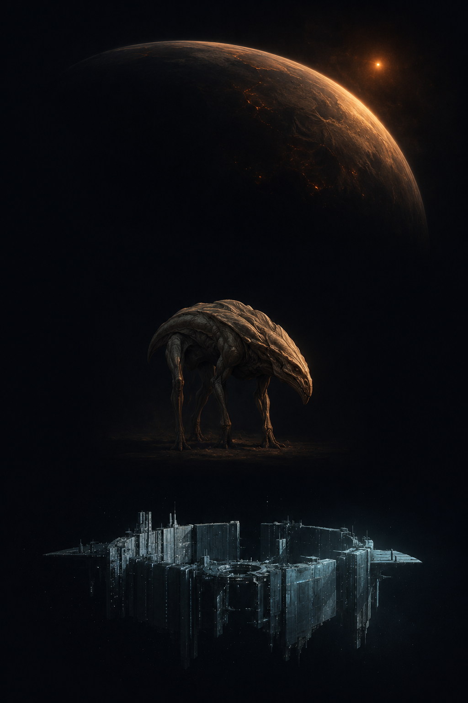

# HOLOS — Content art
### Project plates — pregeneration prompt sheet (cinematic matte)

*One standalone prompt per entry in the project catalog
([`server/src/projects.ts`](../server/src/projects.ts)) and per inherited
rung 0 of the instrument axes ([build-instruments.md](./build-instruments.md)
Decisions 2, 4 and 8), for pregenerating a mix-and-match asset library. Unlike
the archetype technology plates, **these plates are shared by every
civilization**: the deep array is the same deep array whoever built it, so
nothing here carries archetype character, posture or lean. Instrument first,
always. Content art is the representational register decided in
[ui-design.md § Two registers of art](./ui-design.md) — its bans do **not**
come from [ui-image-brief.md](./ui-image-brief.md), which governs only the
austere interface. **No art is generated here — these are prompts only.***

**How to use:** generate the shared **STYLE ANCHOR** once (below), then compose
each render as `--sref <anchor> + STYLE BLOCK + FRAMING + one SUBJECT PROMPT`.
Render **every subject at both 1:1 (square) and 16:9 (widescreen)** — the
subject prompts are framing-agnostic and the FRAMING block covers how each crop
composes. Each subject keys to a stable id: a catalog plate's slug is its
`ProjectId`, and an inherited plate's slug is `inherited-<axisId>`. Store the
two crops as `projects/sq/<id>.webp` and `projects/wide/<id>.webp` (the
per-entry slug below is the shared identity), so the sheet and the report
resolve art by id through `projectArt(id, ratio)` with no lookup table beyond
the id. (Each subject line below is tagged `→ projects/<id>.webp` — that
notation names the plate's identity slug, not a file on disk; on disk each
plate is stored as the two crops above, under `sq/` and `wide/`.)

---

## STYLE ANCHOR — generate once, reuse everywhere  *(shared across all four docs)*

**Adopted anchor:** [`concepts/00-content-style-anchor.png`](./concepts/00-content-style-anchor.png)
— feed this image as the `--sref` (Midjourney) or style-reference input for
every plate in all four docs. Warm ember planet over a cool moonlight-cyan
structure: it carries the palette (ember = warm/alive, cyan = your own works)
as well as the rendering. The prompt below is what produced it, kept for
reference and regeneration.

The whole library shares **one** style anchor, not one per axis: a style
reference carries *look*, not subject, so a single anchor is what keeps worlds,
species, technology, and projects reading as one product when they composite on
a card. Generate it once, then feed it as `--sref` (Midjourney) or the
equivalent image-style input to every prompt in all four docs. If the anchor
tries to force its own composition onto a single-subject render, lower the style
weight (`--sw 50–80`); raise it if the look drifts.

> **STYLE ANCHOR PROMPT** — A style reference sheet for a hard-science-fiction
> art library: three small studies with generous dark space between them on one
> near-black (#070B12) field — at top a painterly planet seen from orbit, its
> curved terminator catching a dim ember sun; at center a lone alien creature as
> a museum specimen study, anatomically plausible, lit from one side; at the
> bottom a single compact megastructure in space, its own works picked out in
> faint moonlight-cyan (#9FC4CC). All three in identical cinematic
> matte-painting rendering — painterly yet photoreal, fine filmic grain, deep
> shadow, volumetric depth, muted and desaturated but for ember-amber (#D08A4A)
> warmth and moonlight-cyan construction. Solemn, elegiac, deep-time restraint.
> No text, labels, UI, borders, people, or watermark. Render at 1:1 and 16:9.

Once you have a plate you love in *this* axis, keep it as the axis's **framing
exemplar** — a secondary reference for pose / scale / orbit conventions, chained
alongside the master anchor. That locks composition within the axis without
introducing a second *style*.

---

## STYLE BLOCK  *(identical in all four content-art docs — edit them together)*

> Cinematic matte painting in the style of high-end film concept art and
> natural-history documentary stills — painterly yet physically photoreal:
> real light, real materials, atmospheric depth, fine surface detail, a faint
> filmic grain. Low-key dramatic lighting from a single dominant source; deep
> shadow; volumetric haze. Muted, desaturated palette anchored in near-black
> (#070B12) and warm off-white (#E8E4DA); color is meaning, used sparingly —
> ember-amber (#D08A4A) for whatever is warm, alive, or radiant, and
> moonlight-cyan (#9FC4CC) reserved strictly for a civilization's OWN works
> and bio-light. Solemn, elegiac, deep-time mood; immense stillness; restraint
> over spectacle; hard-science-fiction plausibility throughout. No text,
> letters, numerals, UI, HUD, diagrams, arrows, or borders; no neon, lens
> flare, or bloom; no cartoon, anime, or video-game-render look; no people or
> human artifacts; no watermark or signature.

## ISOLATION — one subject, neutral ground  *(the mix-and-match rule)*

> ONE SUBJECT ONLY, centered on a neutral cinematic ground so it composites
> cleanly onto either partner layer. Do not paint the other two layers: a
> **technology** plate shows the works with NO creatures and NO identifiable
> home planet (a dimmed or partial star, or bare space, is fine as the thing
> the works act upon). The ground is deep, near-black space. A built object,
> never a landscape.

## FRAMING — projects

> A single instrument or work — one term of an interferometer, or the whole
> array as it stands — centered against near-black, with the system reduced to
> bare space and at most one dimmed or distant star for the work to act upon.
> Real optics and real thermal engineering: thin cold collectors on spare open
> frames, radiators, sunshades, sealed housings, hardware built to receive.
> Never a radar dish, never a saucer, never a lit console. Moonlight-cyan marks
> the civilization's own construction; ember-amber marks only what is genuinely
> warm or radiant, which in most of these plates is one distant star and nothing
> else. Scale is implied by the fineness of the detail and by the emptiness
> around it, never by a reference object.
>
> Render both crops: **16:9** sets the work against a wide sweep of empty space,
> which is often half the subject (a baseline is a distance); **1:1** frames it
> tighter and more iconic. Same object and scale cues in both — only the
> negative space changes.

---

## Subject prompts

*Seventeen catalog entries, then twelve inherited rung 0 plates. The catalog
entries depict the work being bought; the inherited plates depict what the
civilization already owns on that axis, including the four axes whose rung 0 is
**none** — there the lack is the subject, painted as the measurement that
cannot be made. Cost class sets grandeur: an investment is a station, an
endeavor is a program, an epochal is an era.*

#### deep-array · Extend the deep array — instrument / collecting area · investment  → `projects/deep-array.webp`
> A widening field of thin, cold light-collectors held in the same geometry
> across empty space, hundreds of identical faint apertures stepping back into
> the dark until they are only glints, new ones still being set among the old.
> Each is a bare figured surface on a spare frame, cyan-marked, catching a
> distant ember star as a pinpoint. Nothing radiates; the array only gathers.

#### standing-survey · Commission the standing survey — instrument / a program, no axis · investment  → `projects/standing-survey.webp`
> A rank of cold collectors turned in unison onto a patch of sky with nothing in
> it: the same instrument, aimed by schedule rather than by interest. The
> apertures stand in a neat rotation, cyan edge-light along their frames, a
> faint scatter of distant ember stars beyond and no bright target anywhere in
> the frame. Deliberate, methodical emptiness; an instrument keeping an
> appointment.

#### cold-band-refit · Refit the array to the cold band — instrument / band · investment  → `projects/cold-band-refit.webp`
> A single collector rebuilt for the long wavelengths and chilled to do it:
> layered sunshades stacked behind it, broad radiator fins spread into the dark,
> the optic itself sunk deep in a frosted housing with fresh detector modules
> seated at its focus. Cyan marks the new work against the older frame. The far
> ember star is held off it by the shades; the instrument gives off nothing of
> its own.

#### focal-line-observatory · Emplace a focal-line observatory — instrument / the borrowed lens · endeavor  → `projects/focal-line-observatory.webp`
> A single small, cold instrument holding station hundreds of astronomical units
> downstream of its star: a speck of cyan-marked hardware alone in the deep,
> dwarfed by the thing it is using. Far ahead the star sits behind its own
> occulting disc, and the light of something much further off has closed around
> it into one thin, unbroken ember ring, drawn perfectly round. The instrument
> radiates nothing. The lens was never built.

#### long-baseline-optical · Open the long baseline — instrument / baseline · investment  → `projects/long-baseline-optical.webp`
> Two cold collectors holding station an astronomical unit apart against
> near-black, each a bare figured mirror on a spare cyan-marked frame, each so
> small in the frame that the emptiness between them is the subject. Fine trim
> optics and delay hardware ride behind both, the path lengths matched to a
> fraction of a wavelength. A distant ember star throws them into faint relief.
> Separation, not aperture, is what is being built.

#### occultation-network · Spread the occultation net — instrument / shadows · investment  → `projects/occultation-network.webp`
> Small receiving stations spread thin across an enormous volume of dark space,
> each a squat cold post with a wide flat light-bucket and a cyan-marked mast,
> running unlit. A faint band of dimming sweeps across the field where a
> foreground body's shadow crosses a distant ember source, and three of the
> stations happen to stand inside the track while the rest do not. Spare,
> scattered, patient hardware built only to receive.

#### spectrograph-bank · Rebuild the spectrograph bank — instrument / channels · investment  → `projects/spectrograph-bank.webp`
> A single sealed spectrograph module against near-black, one face open to the
> dark: a beam enters cold, strikes a ruled grating, and fans into thousands of
> narrow slices that run to their own small detectors in a long cyan-lit rank.
> Beside them a reference comb burns as a row of evenly spaced ember points,
> absolutely regular. Chilled precision hardware, compact and heavy, emitting
> nothing of its own.

#### pulsar-timing-array · Enlist the pulsar clocks — instrument / phase reference · investment  → `projects/pulsar-timing-array.webp`
> A cold timing station with its wide receiving apertures turned on a scatter of
> pinprick sources far across the field, each of them a collapsed star throwing
> a narrow ember beam that sweeps past on an exact schedule. Racks of
> cyan-marked reference hardware bank behind the receivers, all of it built to
> listen and none of it to speak. The pulses were arriving anyway; the
> instrument only adopts them.

#### neutrino-watch · Sink the neutrino watch — instrument / neutrinos · investment  → `projects/neutrino-watch.webp`
> A vast instrumented volume of cold matter sunk deep under rock, its walls a
> close-packed honeycomb of sensor spheres receding into total blackness on
> every side. In the middle of it a single faint cyan cone of light marks the
> one particle that finally interacted; everything else passed straight through.
> No ember anywhere but a dim thermal wash at the far edges. Immense, buried,
> silent hardware that only ever receives.

#### cold-logic-annex · Cool the inference annex — dark / correlator · endeavor  → `projects/cold-logic-annex.webp`
> A dense, dark computing mass hanging alone in deep space: a compact block of
> stacked cold logic, matte and almost featureless, with enormous thin radiator
> vanes spread from it into the black. Its only light is a faint ember infrared
> bloom along those vanes, warmth without brightness, and a thread of cyan where
> its own structure is picked out. Heavy, silent, run near the temperature of
> the sky behind it.

#### sky-vault · Commit the sky to the Vault — dark / archive · endeavor  → `projects/sky-vault.webp`
> A passive storage mass in deep space: a dark, low slab of close-packed archive
> medium, matte-surfaced and utterly still, no moving parts and no working
> lights beyond the thinnest cyan seam where its own structure shows. It draws
> almost nothing and gives off almost nothing, sitting cold against the
> near-black with a distant ember star barely raising its upper edge. A thing
> built to keep, not to do.

#### launch-beam · Raise the launch beam — carrier / no axis · endeavor  → `projects/launch-beam.webp`
> A phased emitter standing free in space, a broad flat face of thousands of
> identical cyan-marked elements, throwing one tight ember-gold column of light
> out across the frame. Far down that column a departing sail rides it, edge-lit
> and tiny, already leaving. The beam is invisible to everyone except whatever
> stands in it, and whatever stands in it can see exactly where it came from.

#### focal-line-constellation · Ring the focal line — instrument / the borrowed lens · epochal  → `projects/focal-line-constellation.webp`
> The same small cold instrument repeated down many bearings at once: a scatter
> of cyan-marked specks strung far out along different lines behind one star,
> each holding its own ring of ember light drawn round the same occulted disc,
> each ring belonging to a different distant target. Nothing here is large and
> nothing radiates. The scale is in the spacing, and in how many of them there
> are.

#### second-sightline · Set the second sightline — instrument / phase reference · investment  → `projects/second-sightline.webp`
> One cold station holding position far off to the side of everything else, a
> lone cyan-marked receiver on a spare frame, with the main array reduced to a
> faint line of glints across the far side of the field. Both look at the same
> distant ember source, and the space between the two sightlines shows as a
> thin, uneven veil of interstellar haze lying differently across each. Small,
> remote, receiving.

#### star-null · Null the star — instrument / nulling · endeavor  → `projects/star-null.webp`
> A beam combiner in deep space, two long cold arms bringing a star's light
> together by paths cut to arrive exactly out of step. Where the star should
> blaze there is a clean dark hole with only a faint ember residue ringing it,
> cancelled in the optics. A small companion a little off to the side has not
> cancelled and survives as one warm point beside the hole. Fine cyan structure,
> absolute stillness.

#### fill-the-plane · Fill the plane — instrument / elements · endeavor  → `projects/fill-the-plane.webp`
> A sparse array being filled in: a wide, thin field of identical cold
> collectors where the old, widely spaced elements are joined by many new ones
> seeded into every gap between them, until the spacings run continuous rather
> than scattered. Each is a small bare aperture on a cyan-marked frame, the
> newest still unfinished. A distant ember star lights their edges. Density is
> the subject; no single element is large.

#### flicker-pair · Pair the flicker — instrument / baseline · endeavor  → `projects/flicker-pair.webp`
> Two crude light-buckets light-hours apart: coarse, cheap, unfigured collecting
> cones on plain cyan-marked mounts, nothing precise about either of them, and
> an emptiness between them so large that the second reads as a single glint
> near the far edge of the frame. Each carries only a fast detector and a
> recorder. A far ember star is the one warm thing in view. Enormous separation
> bought with unremarkable hardware.

#### inherited-collecting-area · The inherited array — inherited rung / collecting area  → `projects/inherited-collecting-area.webp`
> The array as inherited: collectors of many different generations spread across
> a whole star system, none of them ever taken down, older frames patched and
> mismatched beside newer ones, all of them cold and thin and unlit. Cyan picks
> out the structure; a distant ember star supplies the only warmth. It is
> enormous, and nothing in it was designed all at once.

#### inherited-baseline · System-scale — inherited rung / baseline  → `projects/inherited-baseline.webp`
> A single pair of cold collectors separated by the full width of a star system:
> one near, bare and thin on its cyan-marked frame; the other so far off that it
> is a single glint against the black, with an unbroken sweep of empty space
> between them holding the whole middle of the frame. A small ember star sits
> off to one side. The distance is the instrument.

#### inherited-elements · Sparse — inherited rung / elements  → `projects/inherited-elements.webp`
> A sparse array: a handful of cold collectors scattered at wide, uneven
> spacings across a great volume of near-black, with enormous unfilled distances
> between them and no pattern to how they fall. Each is a small bare aperture on
> a spare cyan-marked frame, identical to the others and a long way from any of
> them. A dim ember star far off. The gaps are most of what is here.

#### inherited-band · Visible and near-infrared — inherited rung / band  → `projects/inherited-band.webp`
> A collector built for visible light and the near infrared, its warm-figured
> optic and uncooled housing lit hard by the ember star it is pointed near,
> glare flooding the aperture and washing the frame around it. Whatever cold
> thing stands beside that star is not in the picture at all, and there is
> nothing in this instrument that could reach the wavelengths where it would
> show. Cyan trim, warm-running hardware.

#### inherited-channels · Broadband — inherited rung / channels  → `projects/inherited-channels.webp`
> A broadband detector at the back of a cold collector: one wide aperture, one
> plain optic, and a single large sensor where a finer instrument would carry
> thousands. All the light of a source lands together on that one surface as an
> undivided ember-white pool, with nothing anywhere to split it. Spare
> cyan-marked structure around it. Cheap, honest, deliberately coarse hardware,
> summing every line in the light away.

#### inherited-phase-reference · Local clocks — inherited rung / phase reference  → `projects/inherited-phase-reference.webp`
> A local clock module mounted at the heart of the array: a small, heavily
> shielded oscillator in a cold housing, its cyan-marked cabling running out to
> collectors that fade into the dark. It is fine, well-made, ordinary hardware,
> and it is the only timekeeping anywhere in the picture. A dim ember star
> beyond. Everything about it says a good short run, and no memory at all of
> what the phase was a century ago.

#### inherited-archive · Reduced products — inherited rung / archive  → `projects/inherited-archive.webp`
> A modest archive core alone in the dark: a short rank of sealed record
> cartridges seated in a frame built for many times that number, the remaining
> bays open and empty. What was kept is a small, tidy, finished thing; what
> would have filled the empty bays was thrown away as it was reduced. Cold
> cyan-marked structure, one faint ember standby glow, no moving parts. Storage
> holding conclusions and not the light behind them.

#### inherited-correlator · Run warm — inherited rung / correlator  → `projects/inherited-correlator.webp`
> The correlator as inherited, run warm: a dense block of processing hardware in
> space with heat pouring off it, radiator panels glowing a dull ember all down
> their length and a soft thermal shimmer standing around the whole mass. Cyan
> structure shows only where the housings are cold enough to see it. It
> multiplies every collector against every other one, continuously, and pays for
> it in temperature. Heavy, hot, wasteful.

#### inherited-nulling · None — inherited rung / nulling  → `projects/inherited-nulling.webp`
> No nulling: a star's raw, unbroken glare filling the middle of the frame,
> ember-gold and uncancelled, its light flaring across the optic that receives
> it. Somewhere inside that glare a companion is standing, and there is nothing
> in the picture to show where. At the frame's edge a cold cyan-marked collector
> takes the whole blaze straight in, with no combiner and nothing to subtract
> with. The lack is the subject.

#### inherited-shadows · None — inherited rung / shadows  → `projects/inherited-shadows.webp`
> No shadow coverage: a narrow band of dimming sweeps across a great emptiness
> where a foreground body has crossed a distant ember source, and the few cold
> collectors in the frame all stand outside it, holding positions chosen for
> baseline instead. The track passes clean through the space between them and
> nothing is standing in it. Faint cyan structure, an enormous dark volume, a
> crossing that goes unmeasured.

#### inherited-neutrinos · None — inherited rung / neutrinos  → `projects/inherited-neutrinos.webp`
> No second channel: a cold optical array under an enormous field of stars,
> every one of its apertures turned to catch light and nothing here built to
> catch anything else. The ember glow of a far star washes the collectors, and
> the particles leaving its core pass through the whole instrument, its
> shielding and the rock beneath without touching any of it. Cyan-marked frames,
> deep black sky, one channel only.

#### inherited-borrowed-lens · None — inherited rung / the borrowed lens  → `projects/inherited-borrowed-lens.webp`
> No borrowed lens: an ember star alone in the frame, bending the light that
> grazes it, and behind it the line where that light comes back together running
> out into empty black with nothing standing anywhere along it. The only built
> things in view are cold collectors far back at the near edge, small and
> cyan-marked and hundreds of astronomical units short of where the focus
> begins. The largest aperture in reach, unoccupied.

---

## Notes for whoever generates these

The four **none** plates are the hardest and the most valuable: they are the
surface that answers "what can this civilization not do yet", and a plate that
merely looks like an ordinary instrument has failed at it. Each one has a
positive subject (a glare, a shadow track, a sky, a focal line) and the
absence is what the built hardware in frame is standing outside of.

Two things a generator will reach for and must not be allowed. **Radar dishes**:
an interferometer at this tier is thin cold collecting surfaces on open frames,
sunshades and radiators, not parabolic pans on gimbals. **Console light**: the
works are unlit except where the palette rule marks their own structure in
moonlight-cyan, and any warm glow in frame belongs to a star, to waste heat, or
to a beam.

When a plate needs to distinguish two rungs on the same axis, the difference is
scale and spacing, never style: `long-baseline-optical` and `flicker-pair` are
both two collectors, and what separates them is that the second pair is crude,
much cheaper-looking, and unreachably farther apart.
