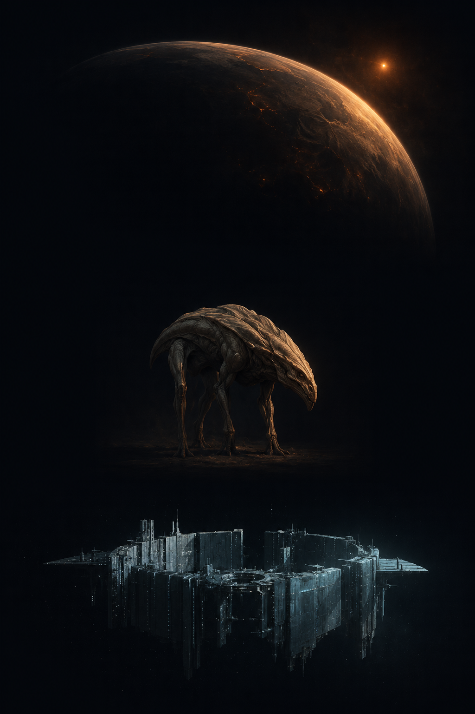

# HOLOS — Content art
### World plates — pregeneration prompt sheet (cinematic matte)

*One standalone prompt per origin world in the cradle catalog
([`server/src/cradles.ts`](../server/src/cradles.ts)), for pregenerating a
mix-and-match asset library. Content art (worlds, species, technology) is the
representational register decided in
[ui-design.md § Two registers of art](./ui-design.md) — its bans do **not**
come from [ui-image-brief.md](./ui-image-brief.md), which governs only the
austere interface. **No art is generated here — these are prompts only.***

**How to use:** generate the shared **STYLE ANCHOR** once (below), then compose
each render as `--sref <anchor> + STYLE BLOCK + FRAMING + one SUBJECT PROMPT`.
Render **every subject at both 1:1 (square) and 16:9 (widescreen)** — the
subject prompts are framing-agnostic and the FRAMING block covers how each crop
composes. Each subject keys to a stable cradle id; store the two crops as
`worlds/sq/NN.webp` and `worlds/wide/NN.webp` (the per-entry slug below is the
shared identity), so the client picks the ratio by layout and resolves art by
seed with no lookup table beyond the id.

---

## STYLE ANCHOR — generate once, reuse everywhere  *(shared across all three docs)*

**Adopted anchor:** [`concepts/00-content-style-anchor.png`](./concepts/00-content-style-anchor.png)
— feed this image as the `--sref` (Midjourney) or style-reference input for
every plate in all three docs. Warm ember planet over a cool moonlight-cyan
structure: it carries the palette (ember = warm/alive, cyan = your own works)
as well as the rendering. The prompt below is what produced it, kept for
reference and regeneration.

The whole library shares **one** style anchor, not one per axis: a style
reference carries *look*, not subject, so a single anchor is what keeps worlds,
species, and technology reading as one product when they composite on a card.
Generate it once, then feed it as `--sref` (Midjourney) or the equivalent
image-style input to every prompt in all three docs. If the anchor tries to
force its own composition onto a single-subject render, lower the style weight
(`--sw 50–80`); raise it if the look drifts.

> **STYLE ANCHOR PROMPT** — A style reference sheet for a hard-science-fiction
> art library: three small studies with generous dark space between them on one
> near-black (#070B12) field — at top a painterly planet seen from orbit, its
> curved terminator catching a dim ember sun; at center a lone alien creature as
> a museum specimen study, anatomically plausible, lit from one side; at the
> bottom a single compact megastructure in space, its own works picked out in
> faint moonlight-cyan (#9FC4CC). All three in identical cinematic
> matte-painting rendering — painterly yet photoreal, fine filmic grain, deep
> shadow, volumetric depth, muted and desaturated but for ember-amber (#D08A4A)
> warmth and moonlight-cyan construction. Solemn, elegiac, deep-time restraint.
> No text, labels, UI, borders, people, or watermark. Render at 1:1 and 16:9.

Once you have a plate you love in *this* axis, keep it as the axis's **framing
exemplar** — a secondary reference for pose / scale / orbit conventions, chained
alongside the master anchor. That locks composition within the axis without
introducing a second *style*.

---

## STYLE BLOCK  *(identical in all three content-art docs — edit them together)*

> Cinematic matte painting in the style of high-end film concept art and
> natural-history documentary stills — painterly yet physically photoreal:
> real light, real materials, atmospheric depth, fine surface detail, a faint
> filmic grain. Low-key dramatic lighting from a single dominant source; deep
> shadow; volumetric haze. Muted, desaturated palette anchored in near-black
> (#070B12) and warm off-white (#E8E4DA); color is meaning, used sparingly —
> ember-amber (#D08A4A) for whatever is warm, alive, or radiant, and
> moonlight-cyan (#9FC4CC) reserved strictly for a civilization's OWN works
> and bio-light. Solemn, elegiac, deep-time mood; immense stillness; restraint
> over spectacle; hard-science-fiction plausibility throughout. No text,
> letters, numerals, UI, HUD, diagrams, arrows, or borders; no neon, lens
> flare, or bloom; no cartoon, anime, or video-game-render look; no people or
> human artifacts; no watermark or signature.

## ISOLATION — one subject, neutral ground  *(the mix-and-match rule)*

> ONE SUBJECT ONLY, centered on a neutral cinematic ground so it composites
> cleanly onto either partner layer. Do not paint the other two layers: a
> **world** plate shows the planet with NO life and NO structures on or around
> it. The ground is deep, near-black, empty space. Nothing orbits it, nothing
> is built on it, no creatures — just the world and the dark.

## FRAMING — worlds

> The planet seen from high orbit, filling roughly two-thirds of the frame,
> its curvature and day/night terminator visible; its star off-frame or a
> single small point of light, never a glowing disc dominating the shot; the
> remainder deep, near-empty space. Photoreal planetary surface with real
> cloud, ice, ocean, atmosphere, and rock physics for the world described.
>
> Render both crops: **16:9** gives the planet room with deep empty space to
> one side (the wide hero and the desktop Stage); **1:1** centers it tighter
> with a thin dark margin. The world is identical in both — only the negative
> space changes.

---

## Subject prompts

#### 01 · TRAPPIST-1e — Terminator terrestrial  → `worlds/01.webp`
> A tidally-locked terrestrial world: one hemisphere scorched in permanent
> day, the far hemisphere ice-black night, a narrow twilight band of liquid
> water and cloud ringing the divide. A huge dim red-amber M-dwarf sun sits
> fixed and low off-frame; several pale sister worlds hang close as crescents
> in the dark. Cold, still.

#### 02 · TRAPPIST-1f — Eyeball ocean  → `worlds/02.webp`
> An "eyeball" ocean world: a single circular pupil of dark open meltwater
> facing its dim red sun, ringed by white pack ice thickening to a fully
> frozen far side. Faint storm cloud curls at the ice margin. Muted, glassy,
> lonely.

#### 03 · Proxima Centauri b — Flare terminator  → `worlds/03.webp`
> A tidally-locked terminator world under a violent red flare-star: the day
> side raked by the glare of a stellar flare mid-eruption, aurorae bleeding
> along the terminator, the night side deep and sheltering. A dangerous,
> beautiful sky; a thin scorched atmosphere. Ember light, hard shadow.

#### 04 · LHS 1140 b — Dense super-Earth  → `worlds/04.webp`
> A dense, high-gravity super-Earth under a calm red dwarf: a thick, heavy,
> banded atmosphere pressed low over dark rock, weather flattened by crushing
> pressure. Vast, weighty, oppressive — a world that pulls everything down.

#### 05 · Ross 128 b — Temperate terminator  → `worlds/05.webp`
> A gentle tidally-locked terminator world under a steady, quiet red dwarf: a
> broad temperate twilight band of dark vegetation-toned land and calm water
> between a warm day side and a cool night side. Mild cloud, soft light; a
> rare survivable red-dwarf world.

#### 06 · TOI-700 d — Ocean terminator  → `worlds/06.webp`
> A mild ocean world, tidally locked under a steady red sun: global seas
> wrapping the planet, a great permanent day-side storm where the sun stares
> straight down, calmer dark water toward the night side. Deep blues gone
> red-muted; weather driven by the eternal day-night contrast.

#### 07 · Teegarden's Star b — Dim ancient temperate  → `worlds/07.webp`
> An ancient temperate world under a faint, old red sun that barely lights it:
> dim ochre landscapes, slow weather, long shadows, a sky perpetually at dusk.
> A world of deep time and scarce light — patient, thrifty, worn.

#### 08 · GJ 667 Cc — Super-Earth, three suns  → `worlds/08.webp`
> A weighty super-Earth beneath a triple-sun sky: one dominant red dwarf
> close, two more distant bright stars in the same heavens, so no part of the
> world knows true night. Layered crossing shadows on the surface; a restless,
> over-lit world.

#### 09 · Kepler-186f — Cold-edge Earth-size  → `worlds/09.webp`
> A cold-edge Earth-size world at the far habitable rim of a red dwarf: mostly
> frozen, white and slate, with dark thawed patches and faint geothermal glow
> along equator and volcanic rifts. Ice-bound, marginal, heat scarce.

#### 10 · Gliese 12 b — Warm-edge terminator  → `worlds/10.webp`
> A warm terminator world under a cool red dwarf: a blazing arid day side, a
> temperate margin of liquid water tracking the light, cool night beyond. Dust
> and heat-haze on the day side; the livable ring narrow and bright-edged.

#### 11 · Luyten b — Temperate super-Earth  → `worlds/11.webp`
> A steady, heavy temperate super-Earth with a fixed red sun: broad continents
> and shallow seas under an even red-gold light, weather calm, no single
> savage feature. Endurance rendered as landscape — solid, unhurried, weighty.

#### 12 · K2-18 b — Hycean (H₂ ocean)  → `worlds/12.webp`
> A hycean world: a planet-wide deep ocean beneath a thick pale hydrogen
> atmosphere, hazed blue-white cloud decks hiding the water almost entirely.
> Huge, soft, opaque — a drowned world that can never see its own sky.

#### 13 · Terminator storm world — Storm-belt terminator  → `worlds/13.webp`
> A tidally-locked storm world: a continuous belt of towering cyclonic storms
> raging along the whole terminator where hot day air meets cold night, calmer
> scorched day and frozen night to either side. Violent cloud walls, lightning
> deep in the bands; braced and wind-carved.

#### 14 · Eyeball ice world — Substellar meltpool  → `worlds/14.webp`
> An ice world with a single small sunlit meltpool: one circular eye of dark
> open water directly under a dim red sun, hemmed on all sides by a vast frozen
> white shell. Stark, enclosed, quiet — nearly all ice.

#### 15 · Tidally-heated moon — Volcanic moon  → `worlds/15.webp`
> A volcanically active moon, a banded gas giant filling much of the sky behind
> it: the moon's surface cracked with glowing lava vents and sulfur-toned
> plains, tidal-heat fissures aglow ember. Chemistry, not sunlight, as its
> source of warmth.

#### 16 · Metal-poor drowned world — Land-less ice-floored ocean  → `worlds/16.webp`
> A land-less ocean world, mineral-poor, under a dim star: unbroken dark water
> pole to pole, floored with pale ice rather than rock, thin high cloud, not a
> scrap of land anywhere. Smooth, endless, bare of stone — a world with no
> fire.

#### 17 · Kepler-442b — Temperate super-Earth (K-dwarf)  → `worlds/17.webp`
> A temperate, weighty super-Earth under a warm orange K-dwarf sun: real
> continents and oceans, day-night and seasons, white cloud systems — close to
> Earth's rhythm but heavier, its horizon subtly over-curved, its light
> amber-gold.

#### 18 · Kepler-62f — Cool water world  → `worlds/18.webp`
> A cool ocean world under an orange sun: deep planet-spanning seas, scattered
> small landless ice caps defining the cold latitudes, pale storm ribbons.
> Blue-grey and cold — a single planetary ocean.

#### 19 · HD 40307 g — Rotating super-Earth  → `worlds/19.webp`
> A rotating super-Earth with proper days and seasons under a quiet orange sun:
> broad heavy continents, shallow seas, banded weather — a full turning world,
> but low-slung and gravity-pressed, its mountains worn flat.

#### 20 · 40 Eridani A b — Temperate super-Earth, white-dwarf companion  → `worlds/20.webp`
> A temperate super-Earth under an orange sun, with an uncanny second light: a
> brilliant point-like white dwarf — a star that already died — hanging in its
> sky beside the living sun. Calm continents below; a permanent memento mori
> above.

#### 21 · Cold-edge desert world — Arid frost-line desert  → `worlds/21.webp`
> A cold desert world at the frost line: endless dune-fields and cracked
> hardpan in rust and bone tones, thin dry air, life clinging only as dark
> threads at ice margins and spring-lines. Arid, conserving, sharp-shadowed.

#### 22 · The temperate twin — Near-Earth garden  → `worlds/22.webp`
> The rare garden world: blue oceans, green-brown continents, white weather
> systems, polar ice — a legible, abundant, Earth-like world under a warm sun.
> Lush and open; the blue marble the galaxy seldom makes.

#### 23 · Kepler-452b — Warming old-Earth  → `worlds/23.webp`
> An older Earth-like world under a swelling, aging yellow-white sun:
> continents drying at the equator, seas retreating, a biosphere past its peak
> and browning under too much light. Beautiful and visibly finite; a warming
> sky.

#### 24 · Kepler-22b — Sunlit ocean world  → `worlds/24.webp`
> A warm world-ocean under a familiar yellow sun: seas covering the whole
> planet, no continents, bright cloud swirls and a clear view to the stars.
> Open, sunlit, blue-gold — an aquatic world with the sky wide open above it.

#### 25 · Tau Ceti f — Bombarded super-Earth  → `worlds/25.webp`
> A super-Earth under bombardment: fresh impact craters and dust-veils
> scarring its metal-lean crust, a bright debris disk and streaking meteors
> crossing the sky, hazy ejecta on the horizon. Battered, dusty,
> catastrophe-shaped.

#### 26 · 55 Cancri e — Molten carbon lava world  → `worlds/26.webp`
> A molten lava world close to its sun: a day side of glowing orange-red magma
> seas and blackened carbon crust, a faint sky of vaporized rock, a cooler dark
> night side. Hellish, radiant — carbon-black and ember.

#### 27 · Runaway-greenhouse-edge world — Hot inner-margin  → `worlds/27.webp`
> A hot inner-margin world tipping toward runaway greenhouse: a thick, bright,
> suffocating cloud deck blanketing the planet, only high mountain peaks and
> polar edges breaking clear. Oppressive white-gold haze — a world fleeing its
> own sky.

#### 28 · UV-scoured F-star world — High-UV terrestrial  → `worlds/28.webp`
> A terrestrial world under a fierce blue-white F-star: harsh actinic light,
> bleached mineral-toned land, deep shaded canyons and thick ozone haze, water
> hoarded in shadowed basins. Bright, scoured, racing a star that dies young.

#### 29 · Bright super-Earth — Rich heavy world  → `worlds/29.webp`
> A metal-rich, heavy super-Earth under a bright hot sun: vivid mineral-streaked
> continents, deep seas, energetic weather — a world of visible abundance and
> demanding light. Saturated within restraint: rich, expansive, fast-living.

#### 30 · Kapteyn b — Ancient metal-poor relic  → `worlds/30.webp`
> An extraordinarily ancient relic world under a faint old halo-star: worn,
> rounded, mineral-starved terrain in muted greys and dim ochre, craters
> softened by eons, a thin tired atmosphere. Older than most of the galaxy;
> patient beyond measure.

#### 31 · Barnard's Star b — Cold metal-poor sub-Earth  → `worlds/31.webp`
> A small, frigid, low-gravity relic world under an old dim red dwarf: pale
> frost plains, thin air, faint geothermal warmth glowing in a few dark rifts.
> Little, worn, enduring — holding on rather than reaching.

#### 32 · Circumbinary world — Two-sun world  → `worlds/32.webp`
> A Tatooine-like world orbiting two suns: a warm orange primary and a smaller
> red companion together in one sky, casting doubled shadows across
> arid-temperate land and shallow seas. Irregular seasons written into banded
> terrain; a sky that is plainly plural.

#### 33 · Super-Mercury — Iron world  → `worlds/33.webp`
> A super-Mercury iron world: a huge, dense, metal-dark globe, cratered and
> sun-scorched, veins of exposed iron catching the light, almost no atmosphere
> or water. Savage gravity implied by its heft; metallic, bare, brutal.

#### 34 · Carbon world — Graphite/diamond world  → `worlds/34.webp`
> A carbon world under a carbon-rich star: dark graphite-black terrain glinting
> with diamond and glassy carbon, tar-black hydrocarbon lakes pooling in the
> low places, a thin oxygen-poor haze. Cold, lightless, chemically alien —
> black on black with cold glints.

#### 35 · Coreless silicate world — Unshielded low-density  → `worlds/35.webp`
> A coreless, low-density world under an unshielded sky: pale silicate plains
> and shallow basins, a thin atmosphere visibly stripping away at the edges,
> faint aurora where radiation pours in unblocked. Exposed, fading, wan.

#### 36 · Subsurface-ocean ice world — Buried vent ocean  → `worlds/36.webp`
> An ice-shelled ocean world: a smooth cracked crust of white-blue ice
> fractured with ridge-lines, a hidden liquid ocean implied by refrozen leads
> and faint vent-warmth glowing up through the deepest cracks. Sealed, silent,
> sunless within.

#### 37 · Titan-analog haze world — Hydrocarbon-sea world  → `worlds/37.webp`
> A cold Titan-like world under thick orange hydrocarbon haze: a smog-gold
> opaque atmosphere with dark methane-ethane seas and river channels dimly
> visible beneath, a faint distant sun. Deep cold, glacial and hazed —
> amber-brown and still.

#### 38 · High-obliquity world — Extreme-seasons world  → `worlds/38.webp`
> A high-obliquity world tilted hard on its axis: one pole baking in continuous
> sun while the other lies in deep frozen dark, a churning band of extreme
> weather between — a planet of violent, non-repeating seasons split between
> fire-lit and ice-locked hemispheres.

#### 39 · Rogue / geothermal world — Starless geothermal  → `worlds/39.webp`
> A starless rogue world adrift in interstellar dark: no sun anywhere, the
> surface lit only by its own geothermal glow — chains of ember volcanic rifts
> and warm meltwater over a black frozen crust, a faint insulating atmosphere.
> Utterly sunless; warmth from within, dark without.

#### 40 · Crushing super-Earth — High-gravity flagship  → `worlds/40.webp`
> A massive high-gravity super-Earth under a calm sun: a huge world with a
> thick, low, heavy atmosphere pressed flat, broad shallow seas and worn
> ground, its horizon barely curving for all its size. The gravity is the
> antagonist; the sky reads as a ceiling.
