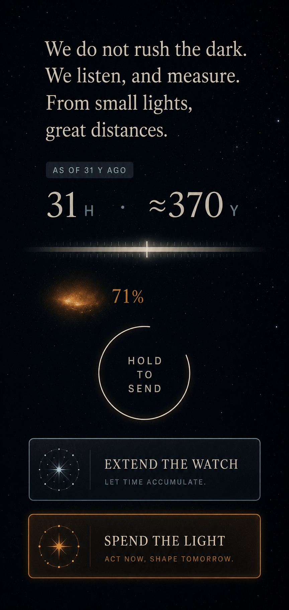

# HOLOS
### UI image-generation brief — mobile-first concept screens

*A copy-paste handoff for an image generator (Midjourney, DALL·E, Flux,
Ideogram, etc.): a single reusable brief and one self-contained prompt
per key screen from [ui-design.md](./ui-design.md). These produce concept
mockups for art-direction exploration — not production UI, not pixel
specs.*

---

## Scope — this brief is for the interface, not the game's content art

**These prompts and their content bans govern the *interface* only** — the
screens, chrome, and reading surfaces: a typeset book crossed with a
scientific instrument. The avoid-list here (no aliens, people, robots,
spaceships, creatures) is a rule about that austere UI register, **not a
ban on representational art in the game.**

**In-game species and technology art is wanted, and is a separate art
track with its own brief.** The bans below do not apply to it. The two
registers divide cleanly:

- **The frame is austere.** The interface — dials, clocks, bottom sheets,
  the sky's belief-render — stays typographic and near-empty. That
  restraint is the Teeming Dark made tangible (ui-design.md, § *Two
  registers of art*).
- **What sits inside the frame is representational.** The life you raise
  across Act 1, the technology you build in Act 2, and your own world are
  things the player knows *intimately* — they get real, rendered species
  and technology art, not smudges. (Technology art still follows the
  fiction's two toolkits — bright megastructures on the energy path,
  compact quiet works on the integration path, vision.md § Source
  framework — so a civilization's tech *looks* like its character; it is
  content, not chrome.)
- **The Teeming Dark still gates distant others.** Representational
  content art is for what *you* are and have seen up close. Another
  civilization observed across light-years is never drawn as a species or
  a machine — it stays a belief, a warmth, a smudge that sharpens with
  confidence (ui-design.md § principles 3–4). Species/tech art renders the
  known, never the inferred.

So: an image generator working on *interface* concepts inherits the brief
below; one working on *species or technology* concepts does not, and gets
its own brief keyed to the cradle, lineage, and tech toolkit it depicts.

---

## How to use

1. **One screen per image.** Compose each generation as
   `THE BRIEF + one SCREEN PROMPT` — or, with the adopted style tile as
   a reference, `SHORT BRIEF + sref + one SCREEN PROMPT` (see *Using a
   style reference* below).
2. **Portrait phone framing.** Use a tall aspect ratio — `9:16` (or
   `9:19.5` if supported; Midjourney: `--ar 9:16`). Every prompt below
   already asks for a full-bleed phone screen, no device bezel.
3. **Consistency.** An adopted style tile lives at
   [`concepts/00-style-tile.png`](./concepts/00-style-tile.png); feed it
   as a style reference (see *Using a style reference*) so the whole set
   reads as one product. Screen 0 below regenerates one from scratch if
   you'd rather. All concept renders live in
   [`concepts/`](./concepts/README.md).
4. **Text will be wrong.** Image models mangle words; treat all rendered
   text as greeked placeholder and judge type *scale, weight, and
   rhythm*, not spelling. Ideogram/Flux handle short labels best if
   exact words matter.
5. The palette and type here are the **working art-direction proposal**
   (flagged in ui-design.md's open questions) — iterate on the brief
   freely; the screen prompts' *content* comes from ui-design.md and
   should stay stable.

---

## Using a style reference

The adopted style tile lives at
[`concepts/00-style-tile.png`](./concepts/00-style-tile.png) — the render
chosen as the art-direction anchor:

Feed this image to the generator as a **style reference** (Midjourney
`--sref <url>`, or the equivalent image-style input in other tools) and
the whole set inherits its look — palette, grain, matte lighting, mood —
without describing them each time.

A style reference carries **look, not content or rules**. It will not
reliably enforce the layout, which typeface does prose vs. labels, the
color-as-information mapping, or the content bans (the model's stubborn
habit of drawing a galaxy where a single star belongs). So when you use
the sref, paste the **short brief** in place of the full one below:

> Mobile game UI, full-bleed portrait phone, no device frame. Single
> column, one-thumb, decisions as bottom sheets. Typography-led:
> editorial serif for prose, slate grotesque small-caps for labels,
> tabular numerals for clocks; few words, generous spacing. Color is
> information: amber = anything warm or alive in the sky, cyan = the
> player's own civilization, else monochrome. No sci-fi HUD,
> galaxies-as-stars, spaceships, aliens, robots, people, device bezels,
> or watermarks.

- **`--sw` (style weight, default 100):** raise it (150–250) if a
  screen's *look* drifts off the tile; lower it (50–70) if the tile
  forces its *composition* onto a screen that needs a different layout
  (the Model pull-back, signals-in-flight), letting the short brief pull
  structure back.
- **No style reference?** Use the full **THE BRIEF** below instead — it
  carries the same look in words.

---

## THE BRIEF (paste before every screen prompt, when not using a sref)

> Mobile game UI concept, full-bleed portrait phone screen, no device
> frame. Dark astronomical interface: near-black #070B12, faint
> starfield grain, vast quiet black space — a beautifully typeset book
> crossed with a scientific instrument, calm and editorial, never a
> sci-fi HUD. Typography-led: editorial serif in warm off-white #E8E4DA
> for prose, geometric grotesque in slate #8A93A6 for small labels,
> tabular numerals for clocks; large type, few words, generous spacing.
> Color is information, used sparingly — ember-amber #D08A4A for
> anything warm or alive, moonlight cyan #9FC4CC for the player's own
> civilization, else monochrome. Single column, one-thumb, decisions as
> bottom sheets; hairline dividers, soft glows, flat crisp UI over
> softly rendered real starfields. No HUD clutter, neon, holograms,
> hexagons, circuitry, lens flare, glass or chrome, busy dashboards, red
> badges, cartoon or 3D-render look, spaceships, aliens, robots, people,
> device bezels, or watermarks.

---

## Screen prompts

*Grouped by act below. Screen numbers are stable — they're referenced in
*Notes for the set* — so the groups never renumber them. (`concepts/`
filenames use their own group-sequence numbers, not these screen numbers;
[concepts/README.md](./concepts/README.md)'s status table maps each
filename to its screen.) Build-order note: the roadmap now runs
**Act 3 first** ([roadmap.md](./roadmap.md), Phase A), so the **Act 3
groups (screens 7–15) are the active shot list**, plus screen 16 — the
**inheritance ceremony** (session zero for Act-3-first: a card presenting
a generated civilization's world, lineage, dial sheet, and charter to
accept and name) — and screen 17, the home system (present tense),
adopted alongside it. The Act 1 / pivot / Act 2 groups belong to Phase B
and can wait.*

### Style & components · all milestones

#### 0 — Style tile (an adopted tile already lives at `concepts/00-style-tile.png`; this regenerates one)

> Design-system sample sheet for this interface on one phone screen: a
> column of specimen components floating on the dark background — a
> paragraph of serif prose; a small slate label chip reading "AS OF 31 Y
> AGO"; a paired clock reading "31 H · ≈370 Y"; a horizontal dial: a
> soft pale band with a bright notch mark inside it; a blurred
> amber-glowing smudge with "71%" beside it; a thin ring drawn
> three-quarters closed around the words "HOLD TO SEND"; two stacked
> choice cards, one cool slate-toned, one warm ember-edged. Arranged
> like a minimal type-specimen poster.

### Session zero & Act 1 — incubation · Phase B

#### 1 — Session zero: the world reveal

> Opening screen: the upper two-thirds is a planet resolving out of
> darkness — a tidally-locked world lit by a huge dim red-amber sun, a
> thin habitable twilight band between a scorched hemisphere and an ice
> hemisphere, rendered soft and painterly, seen from high orbit. Below
> it, one quiet card: a large empty name field marked by a thin
> underline cursor, three small lines of planetary data in slate
> grotesque, and a small stark label reading "TIER IV — HARSH". No
> buttons visible except one subtle text link at the bottom: "an easier
> world". Immense stillness.

#### 2 — Act 1: the beat, decision moment

> A painterly vignette fills the top half: primitive ocean life under a
> red sun at the shoreline of a dark sea, grainy and atmospheric. Rising
> over its lower edge, a bottom sheet with three tappable choice cards
> in a vertical stack: two cards in cool slate tones (patient,
> garden-like choices) each with a serif line of text and a small word
> "LIKELY" or "UNCERTAIN" in grotesque caps; one card edged in warm
> ember with slightly hotter background (a rare bold intervention)
> marked "LONG SHOT". The cards feel like letterpress slips, not
> buttons.

#### 3 — Act 1: the roll

> A full-screen held-breath moment: everything dark except the center,
> where a single horizontal odds band glows softly — a pale segment
> covering about two-thirds of its length, a hot ember segment the rest
> — and a small bright marker falling toward it in mid-air, motion-
> blurred slightly. One serif line above: the choice being risked. Below,
> tiny slate text: "evolution decides". The feel of a die in the air
> over felt, translated to minimal graphic design.

### The pivot · Phase B

#### 4 — The pivot: the character sheet reveal

> Ceremony screen: five horizontal dials stacked with generous spacing,
> each a soft pale range band with a bright cyan notch landed inside it,
> labels in small caps at each end ("REACH — DEPTH", "VOICE — SILENCE").
> The third dial is mid-animation: its notch trailing a faint comet line
> as it settles. Along the right edge, a thin vertical timeline of tiny
> moments — small dots and dashes — with two dots lit ember,
> hair-lined to the settling dial. At the top, one serif sentence in
> large type, the first words a newborn mind speaks. Dark, reverent,
> museum-lighting.

### Act 2 — the ascent · Phase B

#### 5 — Act 2: the report

> A reading screen, typography-led: a long scrolling account in elegant
> serif on the dark background, written by an immense calm intelligence,
> broken into short scene-paragraphs. Between paragraphs, slim inline
> cards: one showing a tiny system-map thumbnail with an amber ring
> filling in, captioned by a paired clock "14 H · ≈160 Y"; one showing a
> faint telescope smudge with "62%" beside it. A hairline top strip
> holds three tiny project clocks. Feels like reading a mind's account,
> not a dashboard.

#### 6 — Act 2: the system map going quiet

> Full-screen astronomical view of a home star system from above: the
> central star deliberately dimmed, drawn with a tight compact core of
> pale cyan structure close around it — dense, quiet geometry — while
> the outer system is nearly featureless darkness. A very subtle warm
> halo rings the whole system, barely brighter than the background sky
> (the civilization's faint visibility). One small slate label at the
> bottom: "THE VAULT DEEPENS". Progress rendered as quieting, not
> growth. Almost monochrome, breathtaking restraint.

### Session zero — inheritance · Phase A (A1) · the new game entry

#### 16 — Session zero (Act 3 first): the inheritance

> Succession screen — the player is choosing which already-lived
> civilization to *become*, not building a blank one. A vertical carousel
> of three civilization cards on deep black, the middle one focused and
> enlarged, the other two dimmed above and below. The focused card, top to
> bottom: a small painterly planet — a specific world, a drowned ocean
> world under a dim red sun — with a one-line caption in slate small-caps
> naming its species and world ("SONG-CULTURE PELAGIC · A DROWNED WORLD");
> a compact five-dial sheet, each dial a soft pale range band with a bright
> cyan notch already settled inside it, the five ends labelled in tiny caps
> exactly these five in-world labels ("REACH — DEPTH", "VOICE — SILENCE",
> "GARDEN — FORGE", "MONOLITH — CHORUS", "MEMORY — RENEWAL"); an archetype line
> in editorial serif (one of: THE BEACON, THE MONUMENT, THE TIDE, THE
> CLOISTER, THE HERALD, THE SHEPHERD, THE SOWING, THE ENGINE, THE CONGRESS,
> THE PHOENIX — here THE HERALD); and one italic serif fragment of the charter it carries — the
> founding words of a mind with a history. At the very bottom, an empty
> name field with a thin underline cursor and a single word: "BECOME".
> Solemn, elegiac, weighty; immense stillness; the feeling of inheriting a
> life, not starting one.

### Act 3 — the sky & contact · Phase A (A1–A2)

#### 7 — Act 3: the Sky with a source card

> The signature screen. A nearly empty star field fills the screen —
> true darkness, sparse faint stars, one soft amber smudge glowing low
> in the field. A slim bottom sheet is open for that smudge: designation
> "IR-2214" in grotesque, a player-given name "EMBER" in serif beside
> it, a chip reading "AS OF 7.3 Y AGO", and a belief line — "DARK NODE ·
> 71%" — set next to a small blurred thumbnail that is slightly sharper
> than the smudge above. Beneath, a thin horizontal scrubber of the
> source's light history running back into the *past* — the right end is
> "now", ticks receding leftward into earlier decades, no future side (you
> only hold light that has already arrived). The screen must feel almost
> empty; the emptiness is the point.

#### 8 — Act 3: the choice ceremony (broadcast)

> Irreversible-decision screen: the same dark star field, and from the
> player's home mote at center an expanding translucent shell is drawn
> — a perfect thin luminous circle in pale cyan sweeping outward —
> intersecting faint sources one by one, each intersection marked with a
> tiny arrival date. At the bottom center, a thin ring closing around
> the words "HOLD — THIS CANNOT BE UNSENT", rendered as a serene
> typographic ceremony, three-quarters complete. No dialog box, no
> buttons. Gravity and silence.

#### 9 — Act 3: signals in flight

> Traffic screen split vertically: the top third is a dark map
> showing two star-points joined by a hairline arc, a small bright
> point traveling along it at two-thirds of the way; twin clocks beneath
> the arc read "ARRIVES IN 37 MIN · 7.3 Y". The lower two-thirds is the
> signal thread: alternating serif paragraphs, the counterpart's in
> warm off-white, the player's in cool moonlight tone, each stamped with
> a tiny light-age chip. Spare, intimate, astronomical.

#### 10 — Act 3: the Ledger, drift ghosts

> Lineage screen: a sparse vertical tree of a few descendant nodes on
> the dark background, one branch highlighted. The open row shows a
> colony's five dials — bright notches in ember — with the player's own
> notch positions rendered as faint cyan ghosts behind them, visibly
> offset on three of the five dials: two characters diverging, overlaid.
> A staleness chip reads "AS OF 12 Y AGO", and a small drift figure
> "0.14" sits in slate. Quiet genealogical melancholy.

#### 11 — Act 3: sleep and tripwires

> A dimmed interface: the whole screen at ember-glow brightness, as if
> the UI itself is banked coals — all elements present but faded near
> black. Center column: four plain-language rule rows in serif, each
> beginning "WAKE ME —" ("if anything warm moves within 25 light-years",
> "if a beam touches us", "if a fork misses two reports", "after 1,500
> years regardless"), each with a small toggle rendered as a dim ember
> dot. At the bottom, a single line: "the galaxy runs on". The visual
> feeling of a house at night with the pilot lights on.

#### 12 — Act 3: the wake report

> A triage screen after millennia of sleep: at top, a large serif
> headline block — the single most important development — set like
> front-page news in a book, with a small ember chip "WHILE YOU SLEPT ·
> 2,300 Y". Below it, two medium cards of second-order news, then a
> compressed digest list in small slate type. The brightness of the UI
> visibly returning: top of screen fully lit, bottom still ember-dim, a
> gradient of waking. Urgent but never alarmed; no red anywhere.

### Act 3 — the Model · Phase A (A1; echo shell A3)

#### 13 — the Model: the pull-back (Act 3's opening wow)

> A 3D volumetric star map on a phone screen, mid-camera-move: the view
> has just pulled back and off-axis from a night sky, so a field of
> stars is parting into visible depth — thousands of tiny points of
> starlight in true astronomical colors (warm oranges, whites, rare
> blues) with strong parallax layering, sparse and mostly empty, black
> dominating. Near the center-bottom, one minuscule pale-cyan mote with
> a hairline ring marks "HOME". A subtle depth-of-field softens the
> nearest and farthest stars. One small slate label floats low: "THE
> MODEL — WHAT WE BELIEVE". The overwhelming feeling: the sky just
> became a place. Vast, precise, vertiginous, silent.

#### 14 — the Model: your own light, seen from outside

> The poster image. A 3D star map viewed from outside the player's home
> star: around the tiny cyan home mote, a vast translucent spherical
> shell rendered in layers — an outer layer glowing warm ember (the
> civilization's bright years, still traveling), and inside it a much
> dimmer, darker inner shell (the silence that followed, never able to
> catch up). Sparse background stars pierce the shells; the few stars
> currently inside the warm layer are faintly haloed, as if lit by old
> light reaching them now. Caption chip in slate: "YOUR LIGHT · 84 Y
> DEEP". Elegiac, astronomical, breathtaking restraint — a civilization
> orbiting its own past.

#### 15 — the Model: things in flight

> A 3D star chart with knowledge rendered as depth: near stars crisp,
> distant stars progressively ghosted and antiqued, two faint concentric
> guide shells labeled "50 Y" and "100 Y" in tiny slate type. Between
> stars, three hairline arcs each carry a slow bright point — a signal
> in flight, a seedship mid-decade, and one incoming line rendered
> hotter than everything else. One unresolved source is a soft amber
> fuzz-cloud just beginning to condense toward a point. Mostly black,
> few words, immense scale.

#### 17 — the Model: the home system (the present tense)

> The zoomed-in start of the map: the player's own home star system — the
> only thing in the universe rendered in the present, and the one screen
> where nothing is blurred, aged, or uncertain. A modest warm-white star
> at center, small and razor-crisp (a point of light, not a giant orb),
> ringed by thin hairline orbit lines with a few planets as tiny sharp
> points. Close around the star, a delicate lattice of pale moonlight-cyan
> structure — the civilization's young works, precise filigree geometry,
> nothing megastructural. A very faint warm amber halo rings the whole
> system, barely brighter than the black — its visibility to distant eyes.
> At the screen's far edges, the wider star field is dim, soft, and slightly
> out of focus: the past, waiting outside. One serif label by the system —
> a civilization name like "EMBERWARDENS" — with a small slate line
> beneath: "THE PRESENT — EVERYTHING ELSE IS LIGHT". In a bottom corner, a
> subtle outward affordance: faint receding concentric arcs suggesting
> pinch-out to the sky. Crisp against soft; certainty at home, belief
> beyond; immense quiet.

---

## Notes for the set

- Screens **6, 7, 8, and 14** carry the product's thesis (advancement
  as quieting, the empty sky, irreversibility as ceremony, the
  inescapable light echo) — iterate those hardest, and judge every
  candidate by whether the screen feels *quiet*.
- If a generation drifts toward busy sci-fi, strengthen the avoid block
  before touching the screen prompt — clutter is a style failure, not a
  content failure.
- When a look wins, fold its parameters back into the style block, keep
  the seed/style reference, and re-run the full set for a consistent
  concept board.
